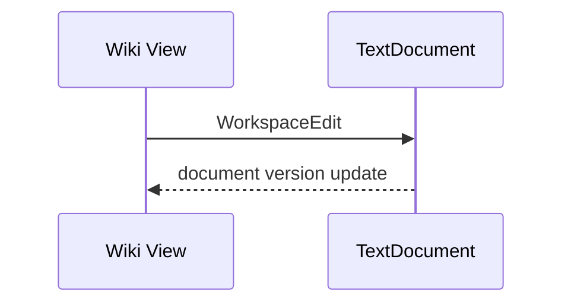

# Obsimini Markdown 從基礎到進階完整測試

> 測試方式：直接點 rendered 文字編輯。複雜區塊可點右上角 `✎`，或雙擊 rendered 區塊開啟 section editor。編輯不應中途自行結束。Section editor 內 `Ctrl/Cmd+Z` 應只復原 textarea 輸入；Apply 後再按 undo，應復原文件修改。

---

## 1. 基礎文字、段落與 Unicode

一般段落可直接編輯：English、繁體中文、日本語、한글、emoji 😀 🚀 ❤️，以及 snake_case、kebab-case、array[0]。

同一段落的 hard-wrapped 第一行，
第二行也應可獨立直接編輯，
第三行輸入時不應突然結束。

這行結尾使用反斜線產生 hard break。\
這是 hard break 後一行。

特殊字元：© ® ™ … — “quotes”；HTML entities：&amp; &lt; &gt; &copy;。

Escapes：\*不是斜體\*、\#不是標題、\[不是連結\]、反斜線 `\\`（必要時用 section editor）。

## 2. 標題 H1–H6

# H1 測試標題
## H2 測試標題
### H3 可直接編輯
#### H4 可直接編輯
##### H5 可直接編輯
###### H6 可直接編輯

Setext H1
=========

Setext H2
---------

## 3. Inline formatting

**bold**、__underscore bold__、*italic*、_underscore italic_、***bold italic***。

~~strikethrough~~、==highlight==、++inserted++、H~2~O、x^2^、`inline code`、<mark>semantic mark</mark>。

巢狀格式：**粗體中的 *斜體***、**~~bold strike~~**、~~==strike highlight==~~、__[formatted link](https://example.com)__。

程式內容：`const value = "**not bold**";`。

## 4. Links、Wiki links 與自動連結

[Markdown link](https://example.com)

[Link with title](https://example.com "optional title")

[Link label with `code`](https://example.com)

相對連結：[README](./README.md)、[heading](#2-標題-h1h6)、[email](mailto:test@example.com)。

自動連結：<https://example.com>、<test@example.com>，以及裸網址 https://example.com/path?q=test。

[[Missing Note]]、[[Missing Note|editable alias]]、[[Missing Note#Heading|section alias]]。

[Reference label][reference-id]、[collapsed reference][]、[shortcut-reference] 與註腳[^basic-note]。

[reference-id]: https://example.com "reference title"
[collapsed reference]: https://example.org
[shortcut-reference]: https://example.net

## 5. Blockquotes 與 Callouts

> 單行 quote 可直接編輯。

> 多行 quote 第一行。
> 第二行包含 **bold** 與 [link](https://example.com)。
> 第三行也應保持可編輯。

> 外層 nested quote
>> 內層 nested quote
>>> 第三層 quote

> [!NOTE]
> Note callout，包含 **格式**。

> [!TIP] 可收合提示
> 這是 Obsidian callout 內容。

> [!WARNING]
> **注意：**不支援擴充語法時應退化為一般引用。

## 6. Bullet、Ordered 與 Task Lists

- flat bullet 可直接編輯
- **formatted flat bullet**
- 第三個項目

* asterisk bullet
+ plus bullet

1. ordered item
2. 第二項
3. 第三項

5. 自訂起始數字
6. 接續項目

- nested parent
  - nested child
    - deeply nested child
  - sibling child

- [ ] unchecked task：點 checkbox 應立即變成 `[x]`
- [x] checked task：點 checkbox 應立即變成 `[ ]`
- [X] uppercase checked task

1. [ ] ordered unchecked task
2. [x] ordered checked task

- [ ] parent task
  - [x] nested completed task
  - [ ] nested pending task

## 7. 可直接編輯的 Tables

下表的 header 與 body cell 文字皆應可直接點擊編輯；pipe、空白 padding、alignment row 不應被破壞。`Tab`/`Enter` 移至下一格，`Shift+Tab` 移至上一格。右上角 `✎` 仍可編輯整張表 source。

| 功能模組 | 支援狀態 | 複雜度 | 備註說明 |
| :--- | :---: | ---: | :--- |
| **基本格式** | 支援 | ⭐ | 粗體、斜體、刪除線 |
| **數學公式** | 支援 | ⭐⭐⭐ | KaTeX rendering |
| **程式高亮** | 支援 | ⭐⭐ | 多種 language theme |
| **任務清單** | [可互動](#6-bulletordered-與-task-lists) | ⭐ | checkbox 可切換 |
| `inline code` | ==highlight== | 100 | cell inline Markdown |

無 leading/trailing pipe 的表格：

Name | Value | Note
--- | ---: | :---:
Alpha | 10 | centered
Beta | 20 | editable

包含 escaped pipe 或複雜內容時，至少必須可由 `✎` section editor 無損編輯：

| Syntax | Example |
| --- | --- |
| escaped pipe | a \| b |
| code pipe | `a | b` |

## 8. Images、Wiki embeds 與圖說

> **圖 1：高解析度風景圖**
> 

> **圖 2：科技感幾何圖形**
> 


![[missing-image.png]]

![[Missing Note]]

圖片與 embed 應保持 rendering；雙擊或按 `✎` 編輯 source 時，不應跳出外部編輯器衝突。

## 9. Code blocks 與語法高亮

### JavaScript

```js
function hello(name) {
  return `Hello, ${name}!`;
}
console.log(hello("Wiki View"));
```

### Python（資料科學範例）

```python
import numpy as np

def generate_sine_wave(frequency=5, duration=1.0, sampling_rate=1000):
    t = np.linspace(0, duration, int(sampling_rate * duration), endpoint=False)
    signal = np.sin(2 * np.pi * frequency * t)
    return t, signal

print(generate_sine_wave()[0].shape)
```

### TypeScript

```typescript
interface User {
  id: number;
  name: string;
  roles: ('admin' | 'user' | 'guest')[];
}

const activeUser: User = {
  id: 101,
  name: 'Victor',
  roles: ['admin', 'user']
};
```

### 無 language 與 indented code

```
plain fenced code
<not-an-html-tag>
```

    indented code
    second indented line

## 10. Mermaid diagrams




## 11. 數學公式（KaTeX）

行內公式 $E = mc^2$ 與歐拉公式 $e^{i\pi} + 1 = 0$。

二次方程式：

$$
x = \frac{-b \pm \sqrt{b^2 - 4ac}}{2a}
$$

常態分佈：

$$
f(x) = \frac{1}{\sigma \sqrt{2\pi}} e^{-\frac{1}{2}\left(\frac{x-\mu}{\sigma}\right)^2}
$$

矩陣與行列式：

$$
A = \begin{bmatrix}
1 & 2 & 3 \\
4 & 5 & 6 \\
7 & 8 & 9
\end{bmatrix}, \quad \det(A)=0
$$

## 12. Footnotes

這裡有基本註腳[^basic-note]、長註腳[^long-note] 與 URL 註腳[^source-note]。

[^basic-note]: 第一個註腳的詳細說明，包含 **bold**。
[^long-note]: 第一行內容。
    縮排後的第二段內容與 `code`。
[^source-note]: 參考資料：[CommonMark](https://commonmark.org)。

## 13. Details、Definition Lists 與 Abbreviations

<details>
<summary>點擊展開：查看隱藏設定</summary>

這裡是被摺疊的詳細內容。

- 支援巢狀 Markdown
- 包含 **bold** 與 `code`

</details>

Term
: Definition with *formatting*.
: 同一術語的第二個定義。

Markdown
: A lightweight markup language.

HTML 與 CSS 是 abbreviations。

*[HTML]: Hyper Text Markup Language
*[CSS]: Cascading Style Sheets

## 14. Safe HTML 與其他 HTML fallback

<mark>可直接編輯的 semantic mark</mark>

<details>
<summary>Safe details</summary>
Details body.
</details>

<div class="custom-test">
一般 HTML block 應保持 rendered/readonly，並能由 section editor 無損修改。
</div>

<!-- HTML comment 應保持在 source，不應遺失。 -->

## 15. Horizontal Rules

三種 horizontal rule：

---

***

___

## 16. 編輯、Undo/Redo 與衝突回歸

1. 修改一般段落後按 `Ctrl/Cmd+Z`，應復原一次，再按 `Ctrl/Cmd+Shift+Z` 或 `Ctrl+Y` 重做。
2. 點 table cell 修改文字，undo/redo 後 table 結構與 caret 不應損壞。
3. 點 task checkbox，source 中 `[ ]`/`[x]` 必須同步切換；undo 應恢復 checkbox。
4. 開啟 table、code、math 或 details 的 section editor，輸入數個字後在 textarea 內 undo，不應關閉 editor。
5. 點頁面其他位置不應自行 Apply；只有 Apply、`Ctrl/Cmd+Enter` 或明確 navigation 才提交。
6. 所有本地修改均不應誤報「外部編輯器已修改」。

最後一段可直接編輯：Basic → Intermediate → Advanced 測試完成。
